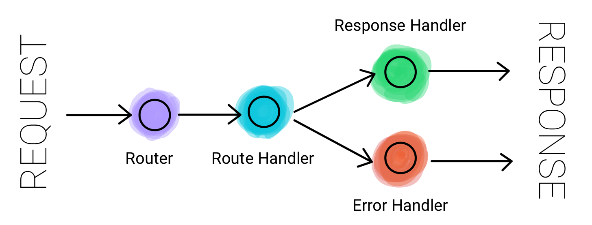

# Backend_Template
Basic Template for NodeJS Backend with MySQL database using Typecript and Typeorm

## 3RE Architecture: Router, RouteHandler, ResponseHandler, ErrorHandler



## How to build and run this project

* Clone this repository.
* Execute `npm install`
* Make sure MySQL is installed your system.
* Login to MySQL using your root user.
* Execute the following MySQL Queries:
  * `CREATE USER 'username'@'localhost' IDENTIFIED WITH mysql_native_password BY 'password';`
  * `CREATE DATABASE DB_NAME;`
  * `GRANT ALL PRIVILEGES ON DB_NAME.* TO 'username'@'localhost';`
  * `FLUSH PRIVILEGES;`
  * `exit`
* Rename the following files:
  * .env.example --> .env
  * ormconfig.json.example --> ormconfig.json
* Provide `username`, `password` and `database` (DB_NAME) info in **ormconfig.json** for typeorm to properly connect to the Database.
* Provide `NODE_ENV` (dev/prod), `PORT` in **.env** file
* Execute `npm start`.

## Project Directory Structure

```
.
├── src
│   ├── controllers
│   │   └── v1
│   │       ├── model1
│   │       │   └── model1.ts
│   │       └── model2
│   │           └── model2.ts
│   ├── core
│   │   ├── ApiError.ts
│   │   └── ApiResponse.ts
│   ├── database
│   │   ├── model
│   │   │   ├── BaseModel.ts
│   │   │   ├── Model1.ts
│   │   │   └── Model2.ts
│   │   ├── repository
│   │   │   ├── Model1.ts
│   │   │   └── Model2.ts
│   │   └── db.ts
│   ├── routes
│   │   └── v1
│   │       ├── router1
│   │       │   └── router1.ts
│   │       ├── router2
│   │       │   └── router2.ts
│   │       └── router.ts
│   ├── utils
│   │   └── asyncHandler.ts
│   ├── app.ts
│   ├── config.ts
│   └── server.ts
├── LICENSE
├── .env
├── ormconfig.json
├── package.json
├── package-lock.json
├── README.md
└── tsconfig.json

14 directories, 25 files


```


### License

```
MIT License

Copyright (c) 2021 Ashish Arora

Permission is hereby granted, free of charge, to any person obtaining a copy
of this software and associated documentation files (the "Software"), to deal
in the Software without restriction, including without limitation the rights
to use, copy, modify, merge, publish, distribute, sublicense, and/or sell
copies of the Software, and to permit persons to whom the Software is
furnished to do so, subject to the following conditions:

The above copyright notice and this permission notice shall be included in all
copies or substantial portions of the Software.

THE SOFTWARE IS PROVIDED "AS IS", WITHOUT WARRANTY OF ANY KIND, EXPRESS OR
IMPLIED, INCLUDING BUT NOT LIMITED TO THE WARRANTIES OF MERCHANTABILITY,
FITNESS FOR A PARTICULAR PURPOSE AND NONINFRINGEMENT. IN NO EVENT SHALL THE
AUTHORS OR COPYRIGHT HOLDERS BE LIABLE FOR ANY CLAIM, DAMAGES OR OTHER
LIABILITY, WHETHER IN AN ACTION OF CONTRACT, TORT OR OTHERWISE, ARISING FROM,
OUT OF OR IN CONNECTION WITH THE SOFTWARE OR THE USE OR OTHER DEALINGS IN THE
SOFTWARE.
```